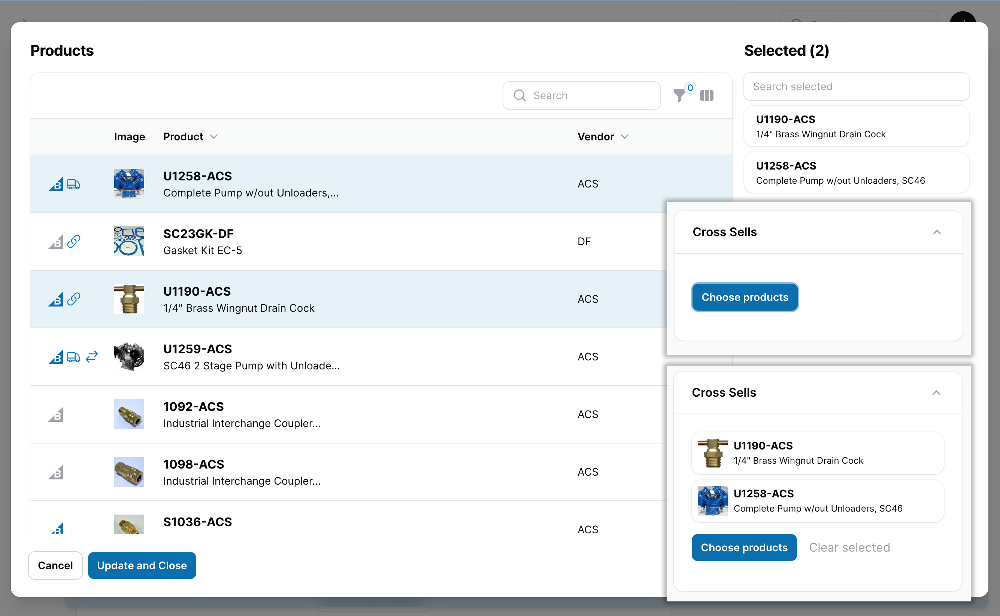

# A powerful resource picker for Filament.

[](https://packagist.org/packages/unexpectedjourney/filament-resource-picker)
[](https://github.com/unexpectedjourney/filament-resource-picker/actions?query=workflow%3Arun-tests+branch%3Amain)
[](https://github.com/unexpectedjourney/filament-resource-picker/actions?query=workflow%3A"Fix+PHP+code+style+issues"+branch%3Amain)
[](https://packagist.org/packages/unexpectedjourney/filament-resource-picker)



Adds a new ResourcePicker form component that lets users browse and select
models
using your existing resources in modal.

## Installation

You can install the package via composer:

```bash
composer require unexpectedjourney/filament-resource-picker
```

## Usage

Add the plugin to your panel provider

```php
use UnexpectedJourney\FilamentResourcePicker\FilamentResourcePickerPlugin;

public function panel(Panel $panel): Panel
{
    return $panel
        ->plugins([
            FilamentResourcePickerPlugin::make(),
        ])
    ])
}
```

Then add the component to your form

```php
use UnexpectedJourney\FilamentResourcePicker\Forms\Components\ResourcePicker;

public static function form(Form $form): Form
{
    return $form
        ->schema([
            ResourcePicker::make('component_id')
                ->resource(ProductResource::class),
        ]);
}
```

This adds a button to your form that when clicked opens a modal with the table
from the resource specified in the `resource()` method. All columns and filters
will be available while all Actions are removed.

Just click a record to select it and click it again to deselect it. When a
record is selected it will show up in the right hand sidebar. You may deselect a
record in this sidebar by hovering your mouse over it and clicking the trash
icon that appears.

Once you've selected the record (or records in the case of a multiple select)
click the update and close. The modal will close and you will see the selected
records reflected in your form. You may remove a record from the selection by
hovering your mouse over it and clicking the trash icon that appears.

### Selecting multiple records (and sorting)

To select multiple records use the `multiple()` method.

```php
use UnexpectedJourney\FilamentResourcePicker\Forms\Components\ResourcePicker;

public static function form(Form $form): Form
{
    return $form
        ->schema([
            ResourcePicker::make('component_id')
                ->resource(ProductResource::class)
                ->multiple(),
        ]);
}
```

If you would like the selected records to be sortable than call the `sortable()`
method.

```php
use UnexpectedJourney\FilamentResourcePicker\Forms\Components\ResourcePicker;

public static function form(Form $form): Form
{
    return $form
        ->schema([
            ResourcePicker::make('component_id')
                ->resource(ProductResource::class)
                ->multiple()
                ->sortable(),
        ]);
}
```

### Integrating with an Eloquent relationship

You may employ the `relationship()` method of the `ResourcePicker` to configure
a `HasMany`
relationship. The `ResourcePicker` will load the item data from the
relationship, and save
it back to the relationship when the form is submitted. If a custom relationship
name is not passed to `relationship()`, the field name will be used as the
relationship name:

```php
use UnexpectedJourney\FilamentResourcePicker\Forms\Components\ResourcePicker;

public static function form(Form $form): Form
{
    return $form
        ->schema([
            ResourcePicker::make('cross_sell_products')
                ->resource(ProductResource::class)
                ->relationship()
                ->multiple(),
        ]);
}
```

#### Sorting items in a relationship

By default, reordering relationship items is disabled. This is because your
related model needs a sort column to store the order of related records. To
enable sorting, you may use the orderColumn() method, passing in a name of the
column on your related model to store the order in:

```php
use UnexpectedJourney\FilamentResourcePicker\Forms\Components\ResourcePicker;

public static function form(Form $form): Form
{
    return $form
        ->schema([
            ResourcePicker::make('cross_sell_products')
                ->resource(ProductResource::class)
                ->relationship()
                ->multiple()
                ->orderColumn('sort')
        ]);
}
```

### Searching selected records

When selecting multiple records you can search the selected records using the
text input above the selected records on the right hand side of
the `ResourcePicker` modal. By default, this filter will use search
the `recordTitleAttribute` configured on the resource. You can configure the
columns used in this filter on a resource by resource basis by configuring your
resource pickers.

### Configuring your resource pickers

Inside the boot method of a service provider
call `ResourcePickerManager::configure()` and pass a key value array. The key is
the class name of the resource you want to configure and the value is a
closure that receives a `ResourcePickerConfiguration` argument
named `$configuration`.

```php
use UnexpectedJourney\FilamentResourcePicker\Facades\ResourcePickerManager;

public function boot(): void
{
    ResourcePickerManager::configure([
        ProductResource::class => fn(ResourcePickerConfiguration $configuration) => $configuration,
    ]);
}
```

#### Configuring fields used for searching results

Use the `searchColumns` method of the `ResourcePickerConfiguration` to pass an
array of columns that should be used when searching through the results in
the `ResourcePicker` modal.

```php
use UnexpectedJourney\FilamentResourcePicker\Facades\ResourcePickerManager;

public function boot(): void
{
    ResourcePickerManager::configure([
        ProductResource::class => fn(ResourcePickerConfiguration $configuration) => $configuration
            ->searchColumns([
                'name',
                'part_number',
                'vendor.name',
            ]),
    ]);
}
```

#### Configuring the selected record previews

The `ResourcePicker` displays the record title configured on your Filament
resource by default. Use the `previewComponent()` method on the
ResourcePickerConfiguration and pass it the name of a Blade component to be used
to display the preview.

```php
use UnexpectedJourney\FilamentResourcePicker\Facades\ResourcePickerManager;

public function boot(): void
{
    ResourcePickerManager::configure([
        ProductResource::class => fn(ResourcePickerConfiguration $configuration) => $configuration
            ->previewComponent('products.card.mini')
    ]);
}
```

Your Blade component can access the selected record by adding a `record`
property as
documented https://laravel.com/docs/10.x/blade#data-properties-attributes.

## Changelog

Please see [CHANGELOG](CHANGELOG.md) for more information on what has changed
recently.

## Contributing

Please see [CONTRIBUTING](.github/CONTRIBUTING.md) for details.

## Security Vulnerabilities

Please review [our security policy](../../security/policy) on how to report
security vulnerabilities.

## Credits

- [Craig](https://github.com/craigkuhns)
- [All Contributors](../../contributors)

## License

The MIT License (MIT). Please see [License File](LICENSE.md) for more
information.
